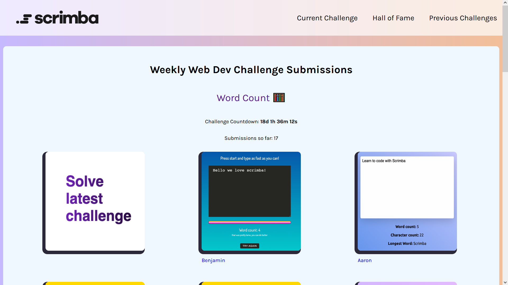

# Weekly Web Dev Challenge 🎉

This is a github repository for [Scrimba's weekly web dev challenge](https://scrimba.com/learn/weeklychallenge) where you can test all your HTML, CSS, JavaScript and UI Design skills! 👀

Even better, we display all your amazing solutions on our [submissions site](https://weeklywebdevchallenge.scrimba.com/) so you can show off your skills and be inspired by fellow Scrimba students as well! 🎨

Plus we hold a weekly live stream [over on Youtube](https://www.youtube.com/c/Scrimba) where we check out your awesome solutions and give away cool Scrimba swag and subscriptions! 💡

If you want to contribute to this project make sure to read [contributing.md](contributing.md) first. 📃

Finally don't forget to join our [Discord server](https://scrimba.com/discord) where you can meet and hang out with fellow Scrimba students as well as participate in many events organized by the Scrimba team! 🥳
